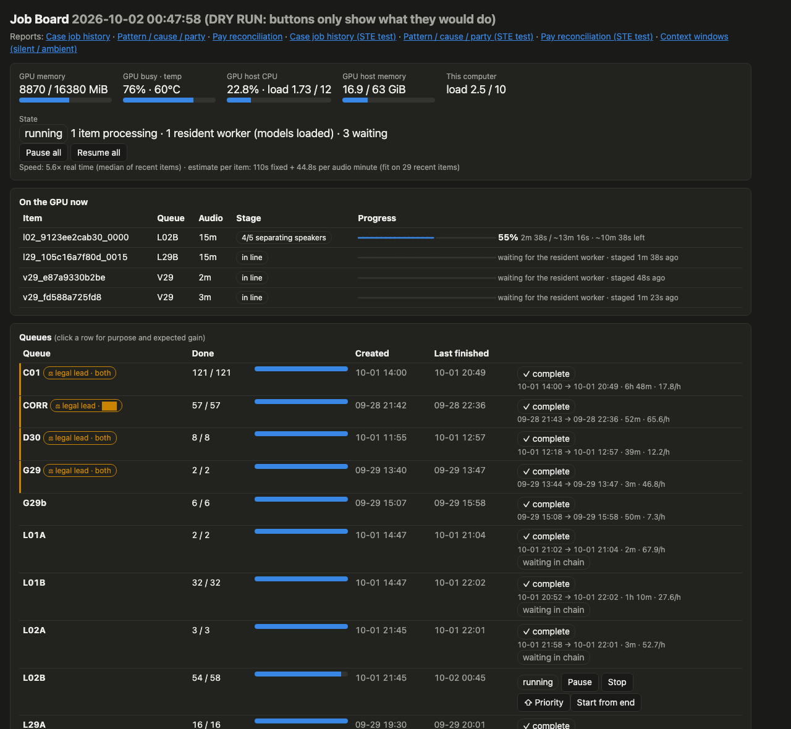

# Job board

A small local page that shows the GPU transcription queues and lets you pause, resume, start or stop them.
Python 3.11+ standard library only; nothing to pip install. See `stack/requirements/jobboard.txt` for the optional tools (pandoc, ssh, ffprobe).

```
cp config/jobboard.example.toml config/jobboard.toml   # then fill in your paths (this file is git-ignored)
python3 stack/jobboard/jobboard.py --dry-run           # try it: buttons only report what they would do
python3 stack/jobboard/jobboard.py                     # live
# open http://127.0.0.1:8797/
```



## What it shows
- **GPU host:** memory used, utilization, number of workers running, and whether the pause flag is set (read over ssh, cached 15 s).
- **Queues:** done / total for every queue file, worked out from which result files exist.
- **Runners:** the queue-runner processes on this computer and the queue each one is reading.
- **Recent log lines:** only status lines (`time label: ok | FAIL | SKIP_LONG`, `STAGE …`, `…_DONE`). Lines with paths or file names are never shown.

## Automatic staging cleanup
With `auto_clear_stale = true`, the board removes the GPU host's **staging copies** (`<label>.orig48k.wav`, `<label>.lev.wav`) of items that
already finished, or that have sat longer than `stale_after_s` (default 8 h) with **no worker process using them**. It checks the running
workers' `--label` first. Originals are never touched. In dry-run it only reports what it would clear.

## Also on the page
- GPU host CPU, memory, GPU memory/busy/temperature, and this computer's load.
- Items on the GPU now, with an estimated progress bar (from the median speed of recent items).
- Recently finished items with finish times; each queue's created time, and optional purpose / source / expected gain / outputs
  from `registry_file`; links to local report files listed in `reports`.

## Controls
| Button | What it does |
|---|---|
| Pause all / Resume all | creates or removes every pause flag on the GPU host (`pause_flag` plus `extra_pause_flags`). Runners finish the item they are on and start nothing new. |
| Start | starts the runner for one queue in the background, logging to `log_dir`. Refused when every remaining item is over the length limit (listed in `long_skip_file`); the row shows "N too long (excerpt route)". |
| Start from end | shown when a queue is already running or waiting in a chain script. Starts a second runner on a reversed copy of the list (in `reverse_dir`, default `from_end/` next to the queues). Runners skip finished items, so the two meet in the middle and at most one item is done twice. One from-end runner per queue. |
| Pause / Resume (per runner) | stops or continues one runner process (SIGSTOP / SIGCONT). The item already on the GPU finishes; that runner starts nothing new until resumed. |
| Stop | ends one runner process (only processes matching `runner_match`). The item already on the GPU finishes. |

Note: each runner checks free GPU memory only before it starts an item, so two runners can start at the same moment and together exceed the card. Add workers one at a time and watch the peak.

## How many jobs at once (measured on a 16 GB card)
WhisperX large-v3 (float16, batch 8) plus pyannote, one process per item. Measured 2026-10-01 by sampling `nvidia-smi` every 5–10 s:

| Jobs at once | Peak GPU memory | Result |
|---|---|---|
| 1–2 | ~6 GB | fine |
| 3 | 12.4 GB | works; one item failed with CUDA out-of-memory when two items started within 10 s of each other |
| 4 | 14.3 GB | CUDA out-of-memory within 4 minutes |

**Recommendation: at most 3 jobs at once on a 16 GB card.** About 2.2 GB per job once it is running; the peaks come when an item starts.

**Short items vs long items**
- **GPU memory does not depend much on audio length.** Audio is transcribed in 30-second windows, a batch at a time, and every item loads the models fresh, so a 15-minute chunk peaks about as high as a 3-hour recording. Both failures above happened in the first seconds of 15-minute chunks (one while loading the model, one in the first batch).
- **Main memory does depend on length.** A 22-hour file reached 51 GB of system RAM and was killed. Set the runner's length guard to 60 minutes (`MAXMIN=60`): every recording over an hour goes to 15-minute chunks and never runs whole.
- **Short items are still the better default:** a failure loses minutes, not hours; a paused or stopped runner gives the GPU back sooner; progress estimates are steadier.
- **But short items mean more model loads,** and each load is a peak. With many short items, start collisions are common (here, 1 in 3 items started within 60 s of another). So keep to 3 jobs, and **let only one 15-minute chunk be on the GPU at a time**: the runner gate waits while another chunk (labels `lNN_…`) is processing, so the other jobs are short files.

**Other things on the same GPU** (a local LLM server, image or video tools) take memory without warning. Count them before adding a job, or stop them while a batch runs.

**Resident workers (measured 2026-10-02).** Loading the models costs about a third of a short item's time. A long-running worker that
loads them once and takes items from a spool (`remote_spool_dir`) produced byte-identical transcripts, word timing, speakers and names on a
10-file test, 2.6× faster. Run **one** resident worker on a 16 GB card, and free the GPU cache after every item: a resident process otherwise
keeps its peak (~7 GB), and two of them ran the card out of memory. The board shows items waiting for the worker as "in line".

**Failed items are not lost.** A runner skips only items whose result file exists, so the next Start of that queue retries them.

## Safety
- Listens on **127.0.0.1 only**. Not reachable from the network.
- Every control call needs the per-run token embedded in the page (a new one each start), and a localhost `Host` header. Other websites can't trigger it.
- Only queue names, counts and item labels appear on the page; no source file names, no transcript text.
- `--dry-run` (or `dry_run = true`) makes every button report its command instead of running it.

## Redacted mode (for demos)
`python3 stack/jobboard/jobboard.py --redact` (or `redact = true`) blocks out every term listed in `redact_file`
(one per line, git-ignored; prefix `cs:` for case-sensitive short terms) plus phone numbers, emails, street addresses,
SSNs and long digit runs, in the status data and in every report page. Only the visible text is changed, so the page keeps working.
